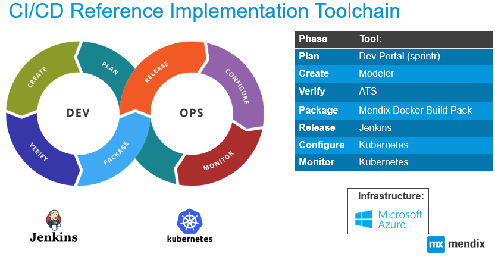
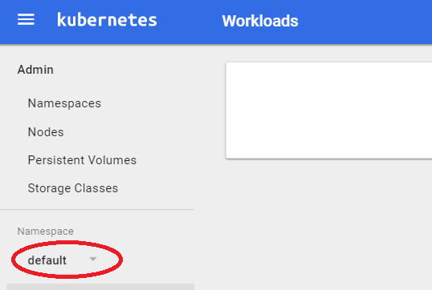
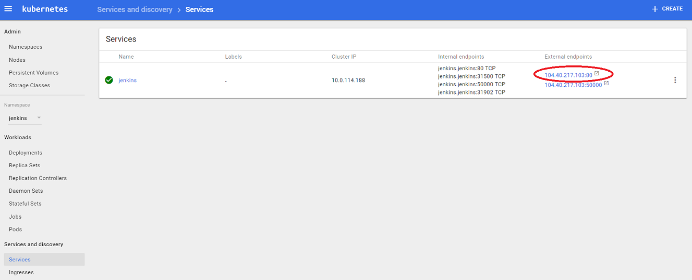
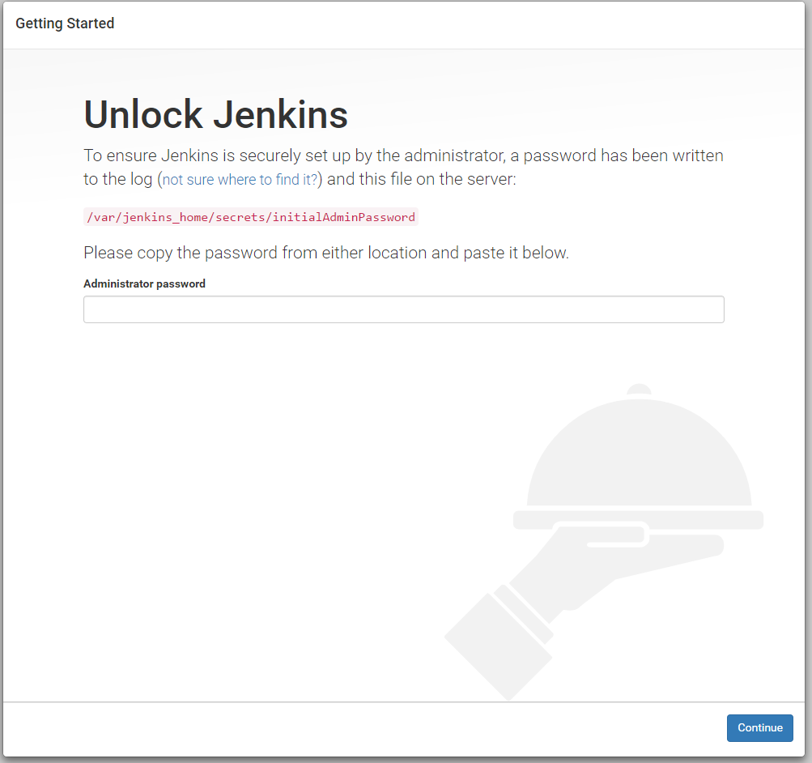
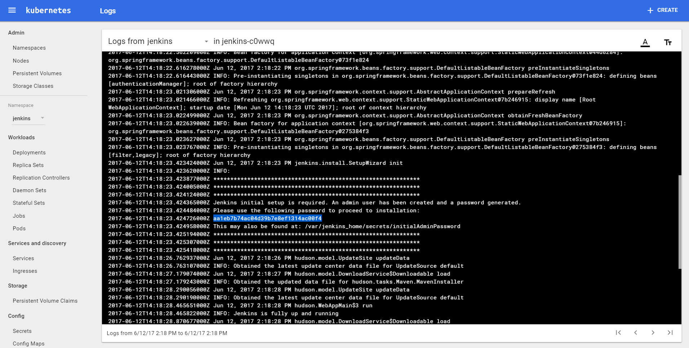
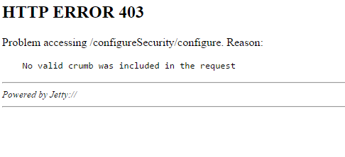
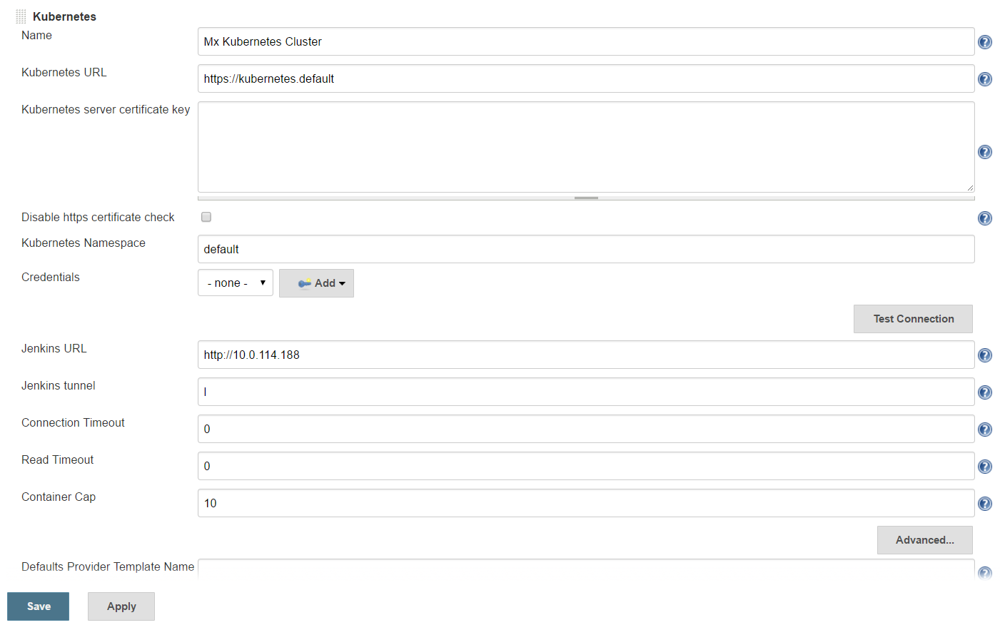
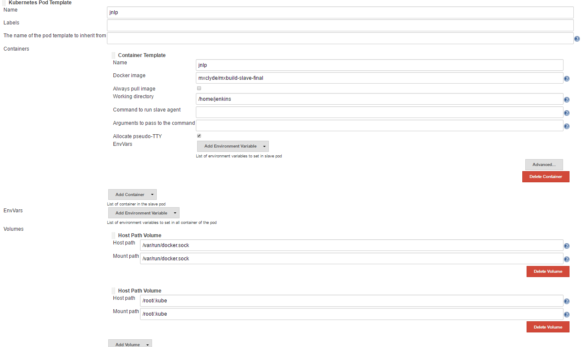
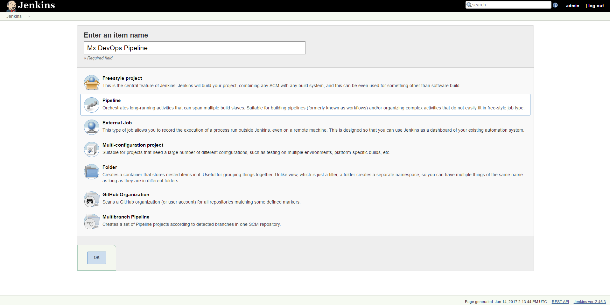

# Mendix Azure Kubernetes CI/CD Reference Implementation

The Mendix Azure Kubernetes CI/CD Reference Implementation is a reference implementation for running a cluster of Mendix runtime instances by setting up a Kubernetes cluster on Azure. The Kubernetes cluster will use Docker containers built using the [Mendix Docker buildpack](https://github.com/mendix/docker-mendix-buildpack). The build and deployment of containers on the cluster is orchestrated using Jenkins.

# Components

The reference implementation uses the following components:

- Infra: [Azure (Container Services)](https://azure.microsoft.com/nl-nl/services/container-service/)
- Docker Cluster Orchestration: [Kubernetes](https://kubernetes.io/)
- CI/CD platform: [Jenkins](https://jenkins.io/)
- [Mendix Docker Build Pack](https://github.com/mendix/docker-mendix-buildpack)

The flow is to run a Jenkins Master containerized in a Kubernetes cluster which spawns temporary Jenkin build slaves in seperate containers for executing Mendix building jobs (using the Mendix build pack). The compiled container image is stored in a private registry and can subequently be used to deploy app nodes to the Kubernetes cluster.



# Prerequisites

- Azure Account with Owner role in the subscription on which the cluster will be deployed
- Azure CLI 2.0

# How to set it up

## Part 1 - Setting up the Kubernetes cluster on Azure

1) Clone this repository using:
```
git clone https://github.com/mendix/azure-kubernetes-cicd-reference-impl
```
2) [Install the Azure CLI 2.0](https://docs.microsoft.com/en-us/cli/azure/install-azure-cli).
3) Login to Azure using:
```
az login
```
4) Download and modify the environment variables in the acsmxcluster.sh shell script to match your needs.
5) Execute the acsmxcluster.sh shell script to setup the cluster. This can take up to 20 minutes.
```
./acsmxcluster.sh
```
## Part 2 - Install and configure Jenkins on the cluster

1) Open the shell you used to setup the cluster. Install Jenkins by running:
```
kubectl create -f jenkins/jenkins-master-manual.yaml
```
2) Run the following command to create a tunnel to the Kubernetes Dashboard
```
kubectl proxy
```
3) Access the Kubernetes Portal by browsing to http://localhost:8001
4) Open the Jenkins namespace by selecting it on the left of your screen.

5) Select the "Services" page under "Services and discovery". Use the top URL to open Jenkins.

6) Jenkins will ask for the initial Administrator password to unlock itself.

7) Retrieve the initial password from the pod log in the Kubernetes Dashboard. Select Workloads -> Pods -> Jenkins-<id> -> View logs and search for the following section:

8) Copy the initial password into Jenkins to start the initial setup.
9) Install the suggested plugins and create an admin user.
10) Jenkins might occassionally raise the folllowing error due to the port forwarding setup used in the cluster:
To fix it: turn Proxy Compatibility on (Manage Jenkins -> Configure Global Security –> Enable Proxy Compatibility)
Setting the option might take a few tries of running into the error.



11) Install the Kubernetes plugin for Jenkins: Manage Jenkins -> Manage Plugins -> Available > 

12) Add a new configuration for the Kubernetes Cloud: Manage Jenkins -> Configure System -> Add a new cloud -> Kubernetes

13) Add a pod template & container configuration for the Jenkins Build Slaves: 

13) Set Jenkins not to build on the master: Manage Jenkins -> Configure System -> Usage = Only build jobs with label expressions matching this node
14) Setup a new pipeline: Create new Job > Pipeline > Enter the pipeline script


Pipeline script:
```
node {
    stage('Get Mendix Build Pack') {
        git 'https://github.com/mendix/docker-mendix-buildpack'
    }
    stage('Retrieve project from team server') {
        checkout([$class: 'SubversionSCM', additionalCredentials: [], excludedCommitMessages: '', excludedRegions: '', excludedRevprop: '', excludedUsers: '', filterChangelog: false, ignoreDirPropChanges: false, includedRegions: '', locations: [[credentialsId: 'mxteamserver', depthOption: 'infinity', ignoreExternalsOption: true, local: 'project', remote: 'https://teamserver.sprintr.com/<project- ID>/trunk']], workspaceUpdater: [$class: 'UpdateUpdater']])
    }
    
    
    stage('Build project & push image') {
      docker.withServer('unix:///var/run/docker.sock') {
        docker.withRegistry('https://index.docker.io/v1', 'dockerregistry')   {
          def image = docker.build("mxproject/companyexpenses:latest", '--build-arg BUILD_PATH=project .')
          withCredentials([[$class: 'UsernamePasswordMultiBinding', credentialsId: 'dockerregistry',
          usernameVariable: 'USERNAME', passwordVariable: 'PASSWORD']]) {
            sh 'docker login -u "$USERNAME" -p "$PASSWORD"';
            image.push();
            }
          }
        }
     }
}
```
15) Add credentials to access the team server to Jenkins (Credentials->System->Global credentials->Add Credentials, use ID: teamserver)


16) Add credentials to access a docker registry to Jenkins (Credentials->System->Global credentials->Add Credentials, use ID: dockerregistry)


*Do not forget to set the correct URL for your Docker Registry and Subversion repository in the pipeline script *

17) Execute the pipeline by clicking "Build now". Your project should now automatically be checked out from the team server and subsequently build.
